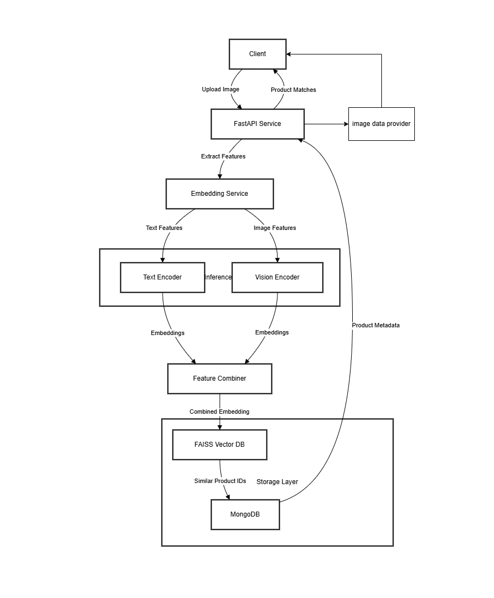
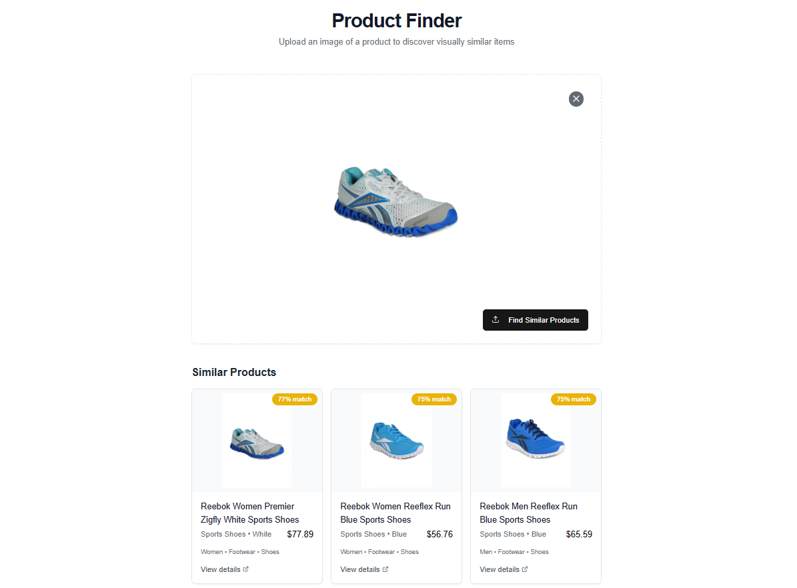

# AI Product Matching System

## Overview
This AI Product Matching System is an end-to-end solution that finds visually and semantically similar products based on input images. It leverages Vector Databases (FAISS), NoSQL Databases (MongoDB), and Vision-Language Models served through NVIDIA Triton Inference Server to create an efficient and scalable product matching pipeline.

The system extracts both visual and textual embeddings from product images and metadata, stores them in a vector database, and enables fast similarity search for new query images. It's designed for e-commerce applications, visual product search, and recommendation systems.

## Architecture


The system consists of the following components:
- FastAPI Web Service: Handles HTTP requests and serves the main API endpoints
- MongoDB Database: Stores product metadata and information
- FAISS Vector Database: Stores and indexes product embeddings for similarity search
- Triton Inference Server: Serves the quantized AI models
- Embedding Pipeline: Combines text and vision embeddings for comprehensive product matching

## Technologies Used
- FastAPI: Web framework for the API service
- MongoDB: NoSQL database for product metadata
- FAISS: Vector database for efficient similarity search
- NVIDIA Triton Inference Server: Model serving infrastructure
- TensorRT: Model optimization and quantization
- Docker: Containerization for easy deployment
- PyMongo: MongoDB interface for Python
- PIL/Pillow: Image processing
- Transformers: Base models for text and vision encoders

## Setup and Installation

### Prerequisites
- Docker and Docker Compose
- NVIDIA GPU with CUDA support
- NVIDIA Container Toolkit

### Installation Steps

1. Clone the repository:
```bash
git clone https://github.com/megh21/ser-code-challenge.git
cd ser-code-challenge
```

2. Download the pre-trained models (optional - system will download them automatically):
```bash
# Text encoder model
mkdir -p model_repository/text_encoder/1
# Vision encoder model
mkdir -p model_repository/internvl3_vision/1
# Other model components
mkdir -p model_repository/image_encoder/1
```

3. Start the services using Docker Compose:
```bash
docker-compose up -d
```

4. Verify that all services are running:
```bash
docker-compose ps
```
## Build Locally

### Requirements
- NVIDIA CUDA Toolkit
- Docker with NVIDIA Container Toolkit
- Triton and TensorRT dependencies
- TensorRT-LLM (optional)

### Setup Virtual Environment
```bash
uv venv venv
uv pip install -r requirements.txt
```

## Usage

### API Endpoints
- **POST /api/match**: Upload an image to find similar products
    - Request: Form data with image file and optional name field
    - Response: JSON with matched products and similarity scores
- **GET /health**: Check the health of system components
- **GET /sync_check**: Verify MongoDB and FAISS databases sync status

### Example Request
```bash
curl -X POST "http://localhost:8000/api/match" \
    -H "accept: application/json" \
    -H "Content-Type: multipart/form-data" \
    -F "image=@/path/to/product_image.jpg" \
    -F "name=Query Product"
```

### Example Response
```json
{
    "matches": [
        {
            "product": {
                "product_id": 12345,
                "name": "Blue Cotton T-Shirt",
                "image_url": "http://example.com/images/12345.jpg",
                "metadata": {
                    "gender": "Men",
                    "masterCategory": "Apparel",
                    "subCategory": "Topwear",
                    "articleType": "Tshirts",
                    "baseColour": "Blue",
                    "season": "Summer",
                    "year": 2023,
                    "usage": "Casual"
                }
            },
            "similarity_score": 0.89
        }
    ],
    "query": {
        "name": "Query Product"
    }
}
```

## Project Structure
```
/
├── docker-compose.yml        # Docker Compose configuration
├── docker/
│   └── Dockerfile           # Main Dockerfile
├── main.py                  # FastAPI application entry point
├── model.py                 # Data models and schemas
├── mongo.py                 # MongoDB connection and operations
├── ingest.py               # Data ingestion pipeline
├── vectordb/
│   └── vector_db.py        # FAISS vector database operations
├── services/
│   ├── __init__.py
│   ├── embeddings.py       # Embedding dispatcher
│   ├── embeddings_local.py # Local embedding service with Triton
│   └── embedding_v_zero.py # Cloud embedding service
├── model_repository/       # Triton model repository
├── tensorrt/              # TensorRT model conversion scripts
├── triton_run.sh          # Triton server startup script
└── requirements.txt       # Python dependencies
```

## Implementation Details
### Data
https://www.kaggle.com/datasets/paramaggarwal/fashion-product-images-dataset

### 1. MongoDB Database
Stores product metadata, including product ID, name, image path, and detailed product attributes. Optimized for fast retrieval of product information.

### 2. Vector Database (FAISS)
- L2 distance-based similarity search
- Batch indexing for efficient loading
- Conversion from distance to similarity scores

### 3. Embedding Generation
- Local mode: Uses Triton Inference Server with quantized models
- Cloud mode: Uses cloud API services when local GPU resources are limited (because they are!)

### 4. Optimizations
- Caching: LRU cache for frequently accessed products
- Asynchronous Processing: Async endpoints for non-blocking operations
- Batch Processing: Efficient batch processing for embedding generation
- Error Handling: Robust error handling with retries

### 5. future scope
- using vlms to generate captions to add more context along with metadata (due to limited compute not possible at the moment)

### frontend 


### Documentation
[Api Guidelines](api_guidelines.md)
[Technical Documentation](documentation.md)
Swagger documentation availalble at /docs when built locally